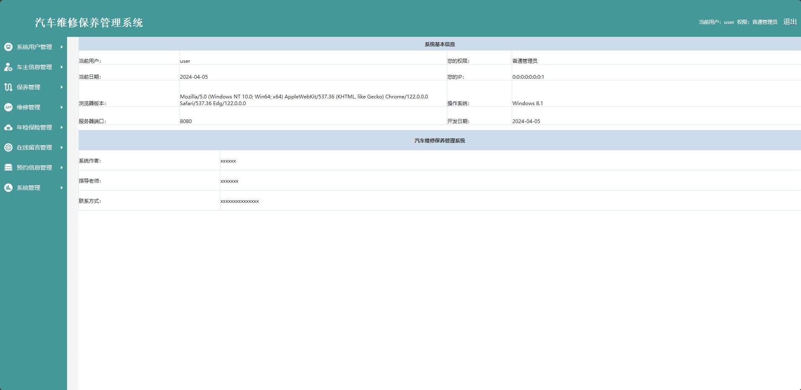
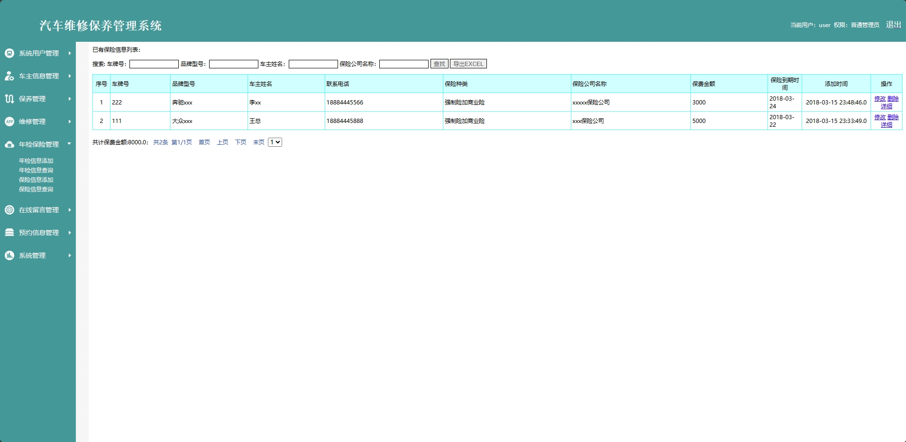
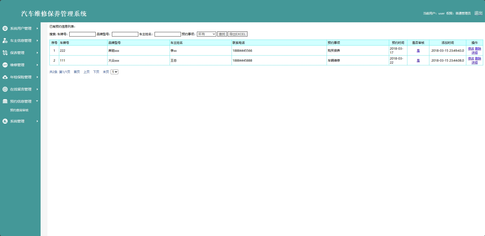
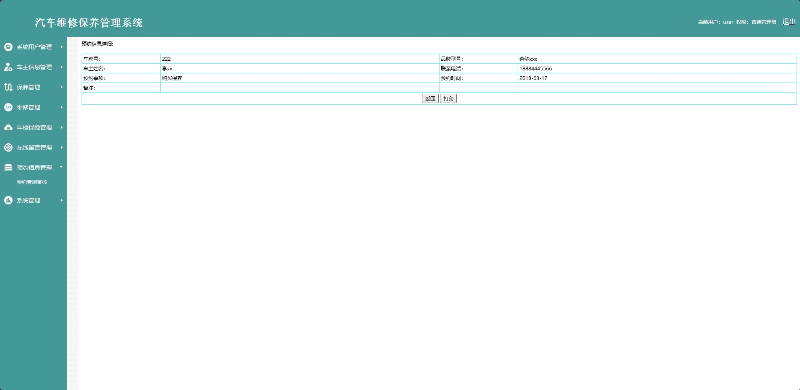
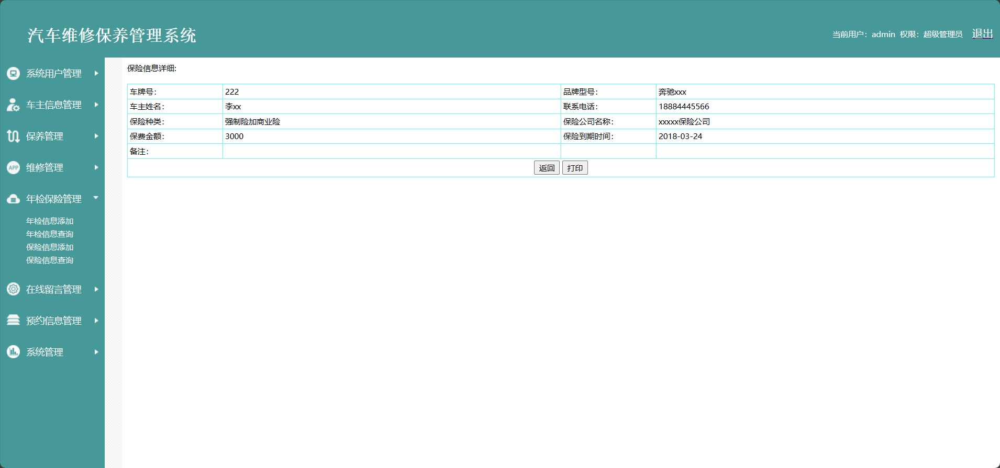

<h1 align="center">基于JSP的汽车维修保养管理系统</h1>

 获取sql文件 QQ: 605739993 QQ群: 377586148 

 [个人站点: 从戎源码网](https://armycodes.com/)

## 简介

> 本代码来源于网络,仅供学习参考使用!
>
> 提供1.远程部署/2.修改代码/3.设计文档指导/4.框架代码讲解等服务
>
> 前端地址：http://localhost:8080/jspm/login.jsp
>
> 管理员: admin 密码: 123456
>
> 车主：user 密码: 123456
>

## 项目介绍

基于JSP的汽车维修保养管理系统：前端 JSP、LayUI、JQuery、Ajax，后端 Java、Servlet、mysql；角色分为管理员和车主。管理员在后台管理车主信息、发布保养类目、回复留言等；车主按按照预约信息进行年检、维修等。主要功能如下：

### 启动方式

- 前端：
> 按钮启动 | 启动Tomcat

- 后端：
> 按钮启动 | 启动Tomcat

### 管理员：

- 基本操作：登录、修改密码、获取个人信息、修改个人信息、上传图片、数据备份
- 系统用户管理：添加用户、删除用户、获取管理员列表、获取管理员详情
- 车主信息管理：添加车主信息、获取车主信息列表、查看车主信息详情、修改车主信息、删除车主信息、导出Excel、筛选车主信息
- 保养条目管理：添加保养条目信息、获取保养条目列表、查看保养条目信息详情、修改保养条目信息、删除保养条目信息、导出Excel、审核条目
- 保养信息管理：添加保养信息、获取保养列表、查看保养信息详情、修改保养信息、删除保养信息、导出Excel、筛选保养信息
- 维修项目管理：添加维修项目信息、获取维修项目列表、修改维修项目信息、删除维修项目信息、导出Excel、筛选维修项目
- 维修信息管理：添加维修信息、获取维信息修列表、查看维修信息详情、修改维修信息、删除维修信息、导出Excel、筛选维修信息
- 年检信息管理：添加年检信息、获取年检信息列表、修改年检信息、删除年检信息、导出Excel、筛选年检信息
- 报险信息管理：添加报险信息、获取报险信息列表、查看报险信息详情、修改报险信息、删除报险信息、导出Excel、筛选报险信息
- 留言管理：获取留言列表、查看留言详情、回复留言、删除留言、筛选留言、导出Excel
- 预约信息管理：获取预约信息列表、查看预约信息详情、修改预约信息、删除预约信息、筛选预约信息、导出Excel、审核

### 车主：

- 基本操作：登录、修改密码、获取个人信息、修改个人信息、上传图片
- 车主信息管理：添加车主信息、获取车主信息列表、查看车主信息详情、修改车主信息、删除车主信息、导出Excel、筛选车主信息
- 保养条目管理：添加保养条目信息、获取保养条目列表、查看保养条目信息详情、修改保养条目信息、删除保养条目信息、导出Excel
- 保养信息管理：添加保养信息、获取保养列表、查看保养信息详情、修改保养信息、删除保养信息、导出Excel、筛选保养信息
- 维修项目管理：添加维修项目信息、获取维修项目列表、修改维修项目信息、删除维修项目信息、导出Excel、筛选维修项目
- 维修信息管理：添加维修信息、获取维信息修列表、查看维修信息详情、修改维修信息、删除维修信息、导出Excel、筛选维修信息
- 年检信息管理：添加年检信息、获取年检信息列表、修改年检信息、删除年检信息、导出Excel、筛选年检信息
- 报险信息管理：添加报险信息、获取报险信息列表、查看报险信息详情、修改报险信息、删除报险信息、导出Excel、筛选报险信息
- 留言管理：获取留言列表、查看留言详情、回复留言、删除留言、筛选留言、导出Excel
- 预约信息管理：获取预约信息列表、查看预约信息详情、修改预约信息、删除预约信息、筛选预约信息、导出Excel

## 环境

- <b>IntelliJ IDEA 2020.3</b>

- <b>Mysql 5.7.26</b>

- <b>Tomcat 9.0.60</b>

- <b>JDK 1.8</b>

## 运行截图

